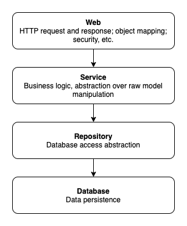

# Testing Strategy

Two broad categories of tests are automated: Unit Test and Integration Test, whose source code are located in `src/test` and `src/integrationTest` correspondingly. Unit-Testing tests three major layers of this software: repository, service and controller whereas Integration-Test tests the program's overall behaviour.

## Unit Tests

Mock objects are used extensively in unit tests, provided by the **Mockito** mocking framework. The dependencies of layers is shown below. In testing one layer, the lower layer it depends on is mocked out.

### Test Web Layer

Web layer tests are conducted via `MockMvc` provided by the **Spring Framework**. Services web controllers depend on are mocked out.

### Test Service Layer

Service layer tests are to ensure services are calling the correct repositories and thus can operate as intended. Repositories are mocked out.

### Test Repository Layer

Repository tests are to check data can be persisted in the database as expected with no structural conflicts (i.e., schema). **TestContainer** provides one-time use and throw database instance which make such tests consistent across time and space.

## Integration Tests

Integration tests eliminate the usage of mock objects, except for `MockMvc` and `TestContainer`, whose usages do not invalidate the test results.